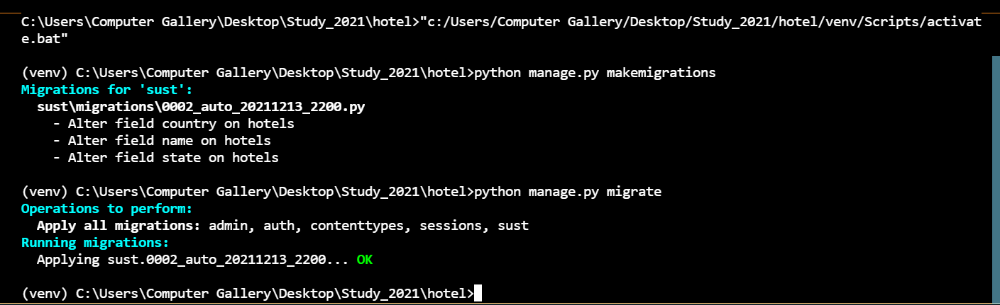

# Hotel Booking

This is a Hotel Management Website. If you are a hotel manager, a website will help you a lot. Like:

- A website will help you enhance the guest experience.
- Websites help increase your hotel revenue and in-stay spend.
- Your own branded website can boost your direct bookings
- You can save time and costs
- A website can improve your operational efficiency
- Maintain and improve brand awareness for your hotel
- Wrap all your guest-facing technology within your hotel website
- A website enables you to support your entire guest journey
- Increase guest loyalty and save on commission
- A website helps your hotel be seen as an innovator in the industry

## Features

- User Login
- Staff Login
- Admin Login
- Hotel Booking
- Multiple types of rooms
- Staff can add new room and location
- User can

## Steps to get started with the software

1.  Clone the repo or download code in zip file

2.  Open the folder in a code editor like VSCode, it will look like this -


- TIP: Create a virtual environment > _Run these commands in the Django_HMS folder through the vscode terminal/ command prompt/ powershell_
  

3. Run `pip install -r requirements.txt` to install all the libraries from "requirements.txt". You can see the last command in the image above.
   
4. Make migrations and migrate.
   _Run these commands_

   ```python
   python manage.py makemigrations
   python manage.py migrate
   ```

   Result will look like -
   

5. Now run either one of the following commands to start the development server.
   ```python
   python manage.py runserver
   django r
   ```
   > Now you should have the server running on - http://127.0.0.1:8000/

## Create super user and create Rooms

1. Now you need to create a superuser to access the admin panel. Run one of the following commands -
   ```python
   python manage.py createsuperuser
   django csu
   ```
2. Open admin panel: http://127.0.0.1:8000/admin
3. Create Room Categories and Rooms
4. Start using the app!
